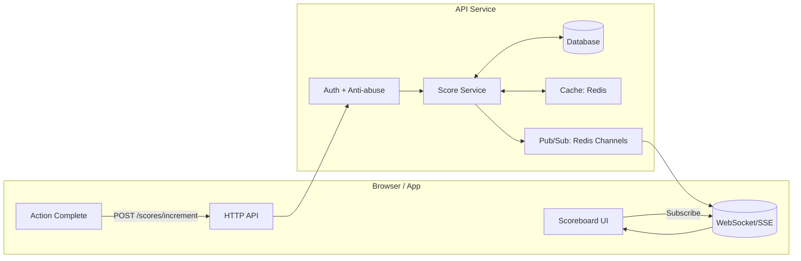
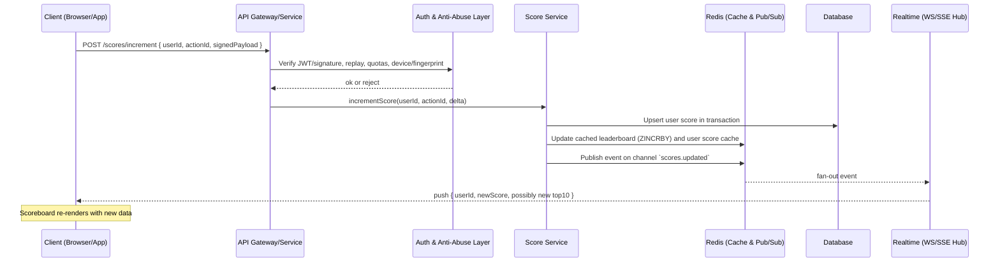

## Problem 6 — Realtime Scoreboard Backend Module Specification

### 1) Overview

We’re building a small, reliable service that keeps a live “Top 10” scoreboard fresh as users complete actions. When someone finishes an action, their score goes up and everyone looking at the board sees it update in near real time. It should be fast, hard to cheat, and easy to operate.

What this module does, at a glance:
- Takes authenticated “increase my score” requests from the website or app
- Stores scores safely so they can’t be forged or double-counted
- Serves the Top 10 quickly
- Pushes updates to connected clients as scores change

### 2) Scope and Non-Goals

- In scope: API endpoints, data model, realtime transport, security and anti-abuse, caching, rate limits, failure handling, observability, and tests.
- Out of scope: Frontend UI, the details of the action itself, payments, and unrelated user data.

### 3) High-Level Architecture



### 4) Execution Flow (Action → Update → Broadcast)



### 5) Data Model

Simple, practical schema:
- `users`: `id`, `display_name`
- `scores`: `user_id` (PK, FK), `score` (integer ≥ 0), `updated_at`
- `score_events` (append-only): `id`, `user_id`, `action_id` (unique per user), `delta`, `source`, `ip`, `user_agent`, `device_id`, `created_at`

Useful indexes:
- `scores(score DESC)` to backstop Redis during outages
- `score_events(user_id, action_id UNIQUE)` for idempotency

### 6) Caching and Leaderboard

Use Redis for the hot path:
- Sorted set `leaderboard:global` with member=`user_id`, score=`score`
- Write path: update DB first, then `ZINCRBY` for the cache
- Read path: `ZREVRANGE leaderboard:global 0 9 WITHSCORES`, then hydrate display names
- Cache user profiles under `user:{id}`

### 7) Realtime Transport

Prefer WebSockets for bi‑directional control; fall back to SSE if needed.
- Publish on `scores.updated`
  - `{ type: "user_score_updated", userId, newScore }`
  - Optionally `{ type: "leaderboard_updated", top10: [...] }` if Top 10 changes
- Clients should fetch Top 10 on connect, then apply updates from the stream

### 8) API Design

Base path: `/api`

1. `POST /api/scores/increment`
   - Auth: required (JWT bearer or session + CSRF)
   - Request:
     ```json
     {
       "userId": "uuid",
       "actionId": "uuid-or-snowflake",
       "delta": 1,
       "signature": "HMAC over canonical payload"
     }
     ```
   - Notes:
     - Idempotent per `(userId, actionId)`; retries return the same result
     - Server decides the real `delta` (clamps or overrides client input)
   - Success (200): `{ userId, newScore, rank, top10IfChanged? }`
   - Common errors: 400 (validation), 401/403 (auth), 409 (idempotency/anti‑abuse), 429 (rate limit), 500

2. `GET /api/leaderboard/top`
   - Query: `limit` (default 10, max 50)
   - Response: `[{ userId, displayName, score, rank }]`
   - Cache for ~300–1000ms with Redis; optionally add ETag/Last‑Modified

3. `GET /api/scores/me`
   - Auth required
   - Response: `{ userId, score, rank }`

4. `GET /api/realtime/token` (if using authenticated WS)
   - Issues a short‑lived token for connecting to WS and scoping permissions

### 9) Security & Anti-Abuse

Practical guardrails to keep scores honest:
- Auth: short‑lived JWTs or sessions (with CSRF)
- Signed requests: HMAC over a canonical payload with `actionId`, server nonce, and timestamp
- Idempotency: `(user_id, action_id)` unique in DB; duplicates return the original result
- Rate limits: sliding window per user and per IP (e.g., 60/min); include `Retry-After`
- Server‑sourced delta: don’t trust the client’s `delta`; clamp or compute on the server
- Replay protection: require `x-request-timestamp`; reject stale windows
- Bot detection: device signals and spike/anomaly detection
- Transport security: HTTPS everywhere; secure cookie attributes
- Authorization: users can only increment their own score
- Audit: structured logs for rejections and admin actions

### 10) Consistency, Ordering, and Concurrency

Make it correct first, then fast:
- Write to the DB in a transaction, then update Redis. If Redis fails, retry and fall back to DB reads.
- Use time‑ordered `action_id`s to detect out‑of‑order duplicates.
- Clients may briefly see stale results; pushes keep staleness under ~1s in practice.
- Use atomic upserts in DB and atomic `ZINCRBY` in Redis to avoid lost updates.

### 11) Error Handling & Responses

Keep errors clear and actionable:
- Shape: `{ code, message, details }`
- Common codes: `VALIDATION_ERROR`, `UNAUTHENTICATED`, `UNAUTHORIZED`, `RATE_LIMITED`, `IDEMPOTENCY_CONFLICT`, `ABUSE_REJECTED`, `INTERNAL_ERROR`
- Include an `x-request-id` for tracing

### 12) Observability

What we watch in prod:
- Metrics: request rates, p95 latency, WS connections, publish latency, cache hit ratio, DB write errors, rate‑limit rejections, idempotency conflicts
- Traces: API → DB/Redis → Pub/Sub → WS
- Logs: structured JSON with PII masked

### 13) Deployment and Scaling

Run it simply, scale when needed:
- Stateless API behind a load balancer; WS hub can be sticky or stateless with shared Redis Pub/Sub
- Managed Redis with HA; DB with read replicas if reads grow
- Scale WS hub separately from the API

### 14) Test Strategy

How we’ll prove it works:
- Unit: idempotency, bounds, server‑delta logic, signature verification
- Integration: API + DB + Redis; correct Top 10 after bursts
- Property: scores never decrease from an increment; replays don’t double count
- Load: steady increments with many WS clients; track broadcast latency and drops
- Security: replay attempts, signature forgery, rate‑limit evasion

### 15) Reference Pseudocode (Server Logic)

```pseudo
POST /api/scores/increment
  require auth
  validate payload { userId, actionId, delta?, timestamp, signature }
  verify signature(HMAC, secret, canonical(payload))
  ensure userId == auth.userId
  enforce rate limits (userId, ip)
  if action already processed (SELECT FROM score_events WHERE userId & actionId):
    return previously computed result
  compute serverDelta = deriveDelta(auth.userId, actionId) or clamp(client.delta)
  begin transaction
    UPSERT scores(userId) SET score = score + serverDelta, updated_at = now()
    INSERT score_events(userId, actionId, delta=serverDelta, ...)
  commit
  cache: ZINCRBY leaderboard:global serverDelta userId
  publish: scores.updated { userId, newScore }
  optionally recompute top10 if affected; publish leaderboard_updated
  return { userId, newScore, rank }
```

### 16) Backward/Failure Modes

Plan for bad days:
- If Redis is down: keep writing to DB; serve reads from DB (slower) until cache recovers
- If WS is down: clients temporarily poll `GET /leaderboard/top` every 2–5s
- If signing secrets/services are unavailable: fail closed for increments

### 17) Additional Improvement Suggestions

Ideas for later:
- Cheat detection jobs to flag anomalies and throttle/quarantine
- Multi‑region options: local Redis with CRDT‑style merge, or a single write leader
- Tiebreakers: e.g., earliest time to reach a score wins the higher rank
- Privacy: opt‑out of public display; show anonymized entries
- Admin tools with a full audit trail and two‑person review for adjustments
- Feature flags to quickly toggle realtime or tighten limits

---

This specification is intended for the backend engineering team to implement the module with production-grade security, performance, and observability.


### Appendix A) Acceptance Criteria

- Top 10 is ordered by score with a clear tiebreaker
- A successful action persists and emits a realtime event within ~1s p95
- Duplicate `(userId, actionId)` does not increase the score again
- Unauthenticated/unauthorized increments are rejected (401/403)
- Exceeding limits returns 429 with `Retry-After`
- Clients get updates when Top 10 changes, and can cold‑start via `GET /leaderboard/top`
- HTTPS enforced; WS authenticated or read‑only for public leaderboard
- If Redis/WS are down, DB writes continue and polling works

### Appendix B) Threat Model Summary

- Spoofed increments → auth + HMAC + server‑decided deltas
- Replay attempts → DB idempotency + timestamps in signatures
- DoS/bursts → per‑user and per‑IP rate limits (sliding window)
- Privilege escalation → enforce `userId == auth.userId`; audit admin actions
- Tampering in transit → HTTPS/TLS + HSTS; secure cookie flags
- DB/cache drift → DB‑first writes with retries; invalidate cache on failures
